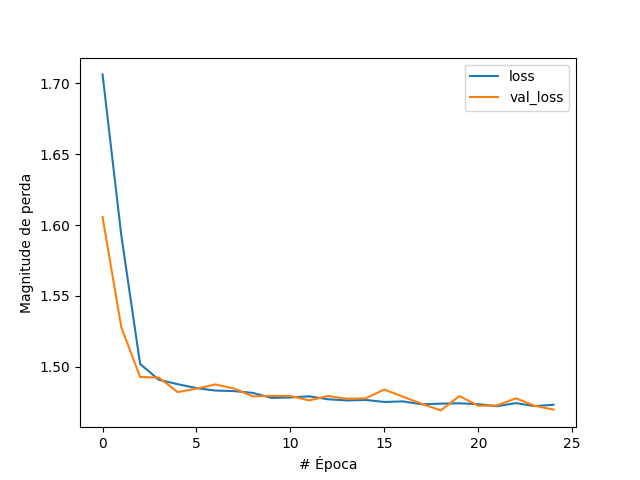
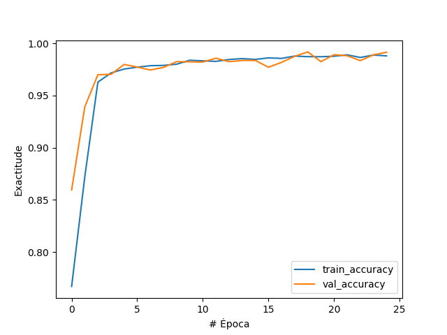
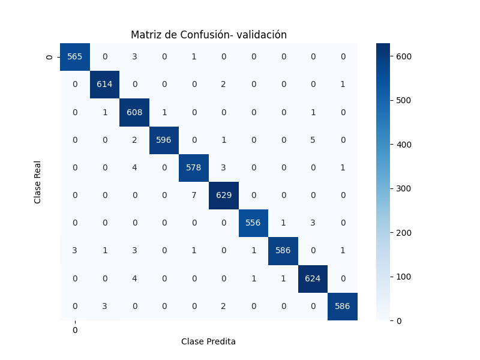

# Multiclass Audio Classification MINST

## Description

Multiclass Audio Classification MINST is a project focused on developing an advanced machine learning model to classify audio data with numbers from 0 to 9. The goal is to perform an EDA analysis of the data and then use a convolutional model to accurately identify and classify various audio samples into multiple classes, including different digits spoken by different individuals.
## Getting Started

### Dependencies

* Operating System: Windows 10 Home 64-bit - version 21H2.
* Programming Language: Python 3.11.
* IDE: PyCharm Professional 2021.3.3
* Libraries:
  * NumPy v1.24.4
  * Torch v2.0.2
  * Matplotlib v3.7.2
  * Librosa 0.10.0
  * Scikit-learn v1.3.0

## Author
Roi Rodríguez

## Data

This project uses the kaggle dataset [Audio MNIST](https://www.kaggle.com/datasets/sripaadsrinivasan/audio-mnist)

## Results
### Training evolution
#### Loss evolution

#### Acurracy evolution

#### Confusion Matrix

